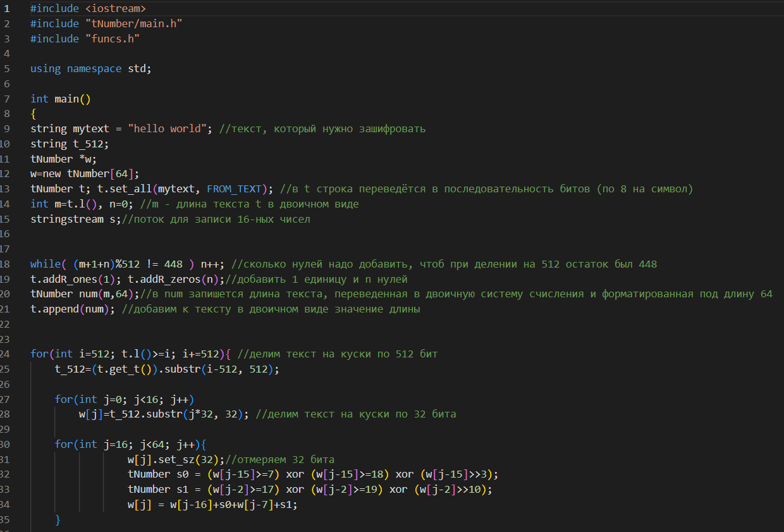
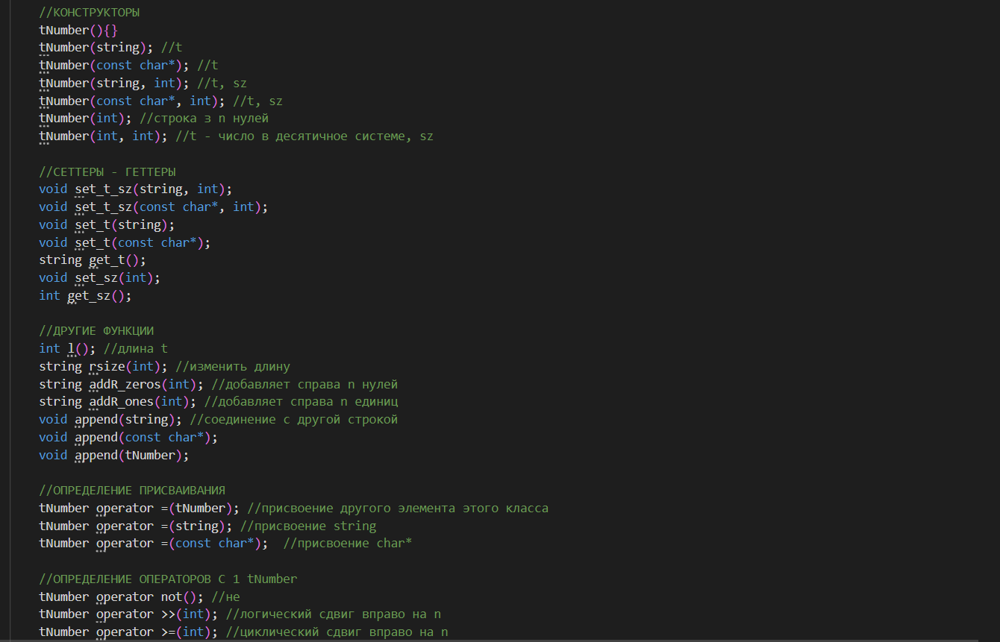
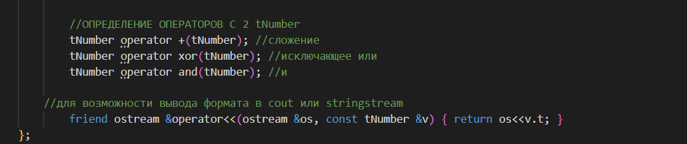

# Дополнительное задание 
## Алгоритм хеширования SHA-256
### Создан класс, предназначенный специально для алгоритма хеширования, выделены функции для определения простого числа, опредён алгоритм нахождения зашифрованной строки
### main.cpp

### funcs.h

